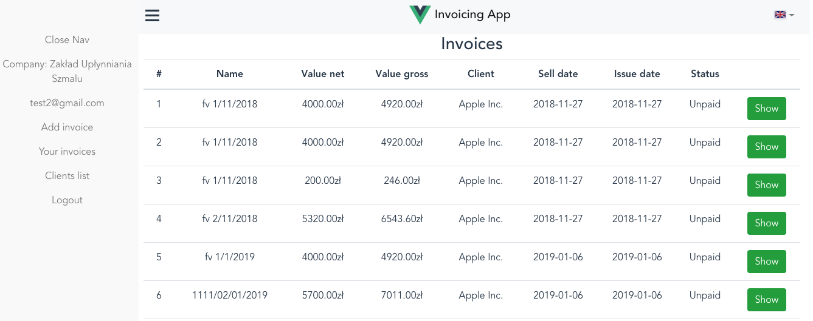

### Setup API
run `npm install`  
create .env file with `DB_FILE=./db/InvoicingApp.db`  
serve on localhost:3000  
`node server`  
or install nodemon and run  
 `nodemon`  
   
 
 ### Setup frontend
 `cd frontend`  
 `npm install`  

 run migrations:  
 `node db/scripts/migrate.js up`  
 
 serve with hot reload at localhost:8080  
 `npm run dev`  
 or  
 `nodemon`  
   
 ### DB  
 `sqlite3 db/InvoicingApp.db`

 ### Screenshots  

 Login screen
 >
   
Register
>
  
User Edit
>  

Clients
>  

Create invoice
>  

FV list
>

FV preview
>